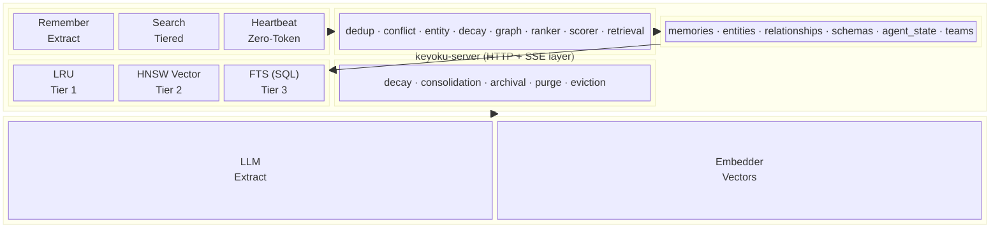

<div align="center">

  <picture>
    <source media="(prefers-color-scheme: dark)" srcset="assets/banner-dark.svg">
    <source media="(prefers-color-scheme: light)" srcset="assets/banner-light.svg">
    
  </picture>

  <p>
    <strong>Intelligent memory engine for AI agents.</strong><br>
    <sub>Extract, store, search, decay, and consolidate memories — all locally with SQLite and in-process vector search.</sub>
  </p>

  <p>
    <a href="#quick-start">Quick Start</a> &bull;
    <a href="#api">API Reference</a> &bull;
    <a href="#architecture">Architecture</a> &bull;
    <a href="#configuration">Configuration</a>
  </p>

  [](https://go.dev)
  [](https://pkg.go.dev/modernc.org/sqlite)
  [](LICENSE)
  [](https://github.com/Keyoku-ai/keyoku-engine/stargazers)

</div>

<br>

<table>
<tr>
<td align="center" width="16%">
  <strong>Semantic Search</strong><br>
  <sub>Tiered HNSW vector + FTS retrieval with LRU hot cache</sub>
</td>
<td align="center" width="16%">
  <strong>Heartbeat</strong><br>
  <sub>Zero-token check for deadlines, decay, conflicts &amp; more</sub>
</td>
<td align="center" width="16%">
  <strong>Knowledge Graph</strong><br>
  <sub>Auto-extracted entities and relationship mapping</sub>
</td>
<td align="center" width="16%">
  <strong>Scheduling</strong><br>
  <sub>Cron-tagged memories with ack tracking</sub>
</td>
<td align="center" width="16%">
  <strong>Teams</strong><br>
  <sub>Multi-agent visibility boundaries</sub>
</td>
<td align="center" width="16%">
  <strong>Pure Go</strong><br>
  <sub>No CGO, no external DB — just SQLite + HNSW</sub>
</td>
</tr>
</table>

## Quick Start

### As a Go library

```bash
go get github.com/keyoku-ai/keyoku-engine
```

```go
import keyoku "github.com/keyoku-ai/keyoku-engine"

k, err := keyoku.New(keyoku.Config{
    DBPath:             "./memories.db",
    ExtractionProvider: "openai",
    OpenAIAPIKey:       os.Getenv("OPENAI_API_KEY"),
})
defer k.Close()

// Store memories from a conversation
result, _ := k.Remember(ctx, keyoku.RememberInput{
    EntityID: "user-123",
    Messages: messages,
})

// Search by meaning
memories, _ := k.Search(ctx, keyoku.SearchInput{
    EntityID: "user-123",
    Query:    "what are their preferences?",
    Limit:    5,
})

// Zero-token heartbeat — no LLM call, pure local query
heartbeat, _ := k.HeartbeatCheck(ctx, keyoku.HeartbeatCheckInput{
    EntityIDs: []string{"user-123"},
})
```

### As an HTTP server

```bash
make build
export OPENAI_API_KEY="sk-..."
./bin/keyoku-server --db ./memories.db
```

Default port: `18900` (override with `--port` or `KEYOKU_PORT`).

## API

<details>
<summary><strong>Memory</strong></summary>

| Method | Path | Description |
|--------|------|-------------|
| POST | `/api/v1/remember` | Extract & store memories from messages |
| POST | `/api/v1/search` | Vector similarity search |
| GET | `/api/v1/memories` | List memories (paginated) |
| GET | `/api/v1/memories/{id}` | Get single memory |
| DELETE | `/api/v1/memories/{id}` | Delete memory |
| DELETE | `/api/v1/memories` | Delete all memories for entity |
| GET | `/api/v1/memories/sample` | Representative sample |

</details>

<details>
<summary><strong>Heartbeat & Monitoring</strong></summary>

| Method | Path | Description |
|--------|------|-------------|
| POST | `/api/v1/heartbeat/check` | Zero-token action detection |
| POST | `/api/v1/heartbeat/context` | Extended heartbeat with LLM analysis |
| POST | `/api/v1/watcher/start` | Start continuous heartbeat monitor |
| POST | `/api/v1/watcher/stop` | Stop watcher |
| GET | `/api/v1/health` | Health check |
| GET | `/api/v1/stats` | Global stats |
| GET | `/api/v1/stats/{entity_id}` | Per-entity stats |

</details>

<details>
<summary><strong>Scheduling</strong></summary>

| Method | Path | Description |
|--------|------|-------------|
| POST | `/api/v1/schedule` | Create scheduled memory |
| POST | `/api/v1/schedule/ack` | Mark schedule as executed |
| PUT | `/api/v1/schedule/{id}` | Update schedule |
| DELETE | `/api/v1/schedule/{id}` | Cancel schedule |
| GET | `/api/v1/scheduled` | List active schedules |

</details>

<details>
<summary><strong>Teams</strong></summary>

| Method | Path | Description |
|--------|------|-------------|
| POST | `/api/v1/teams` | Create team |
| GET | `/api/v1/teams/{id}` | Get team |
| POST | `/api/v1/teams/{id}/members` | Add member |
| DELETE | `/api/v1/teams/{id}/members/{agent_id}` | Remove member |

</details>

<details>
<summary><strong>Events</strong></summary>

| Method | Path | Description |
|--------|------|-------------|
| GET | `/api/v1/events` | SSE event stream |
| POST | `/api/v1/consolidate` | Trigger consolidation |

</details>

## Architecture



## LLM Providers

| Provider | Extraction Model | Embedding | Custom Base URL |
|----------|-----------------|-----------|-----------------|
| OpenAI | gpt-5-mini (default) | text-embedding-3-small | Yes |
| Anthropic | claude-haiku-4-5-20251001 | — | Yes |
| Google Gemini | gemini-3-flash-preview | — | — |

Custom base URLs support OpenRouter, LiteLLM, and self-hosted endpoints.

## Configuration

```go
keyoku.Config{
    DBPath:             "./keyoku.db",
    ExtractionProvider: "openai",        // "openai", "anthropic", "google"
    ExtractionModel:    "gpt-5-mini",
    OpenAIAPIKey:       "sk-...",
    EmbeddingModel:     "text-embedding-3-small",

    // Deduplication
    DeduplicationEnabled:    true,
    SemanticDuplicateThresh: 0.95,
    NearDuplicateThresh:     0.85,

    // Lifecycle
    SchedulerEnabled: true,
    DecayThreshold:   0.3,
    ArchivalDays:     30,

    // Tiered retrieval
    HotCacheSize:   500,
    MaxHNSWEntries: 10000,
    MaxStorageMB:   500,
}
```

Environment variable overrides: `KEYOKU_PORT`, `KEYOKU_DB_PATH`, `KEYOKU_EXTRACTION_PROVIDER`, `KEYOKU_EXTRACTION_MODEL`, `OPENAI_API_KEY`, `ANTHROPIC_API_KEY`, `GEMINI_API_KEY`.

## Development

```bash
make test          # Run all tests
make test-race     # With race detector
make bench         # Benchmarks
make build         # Build for current platform
make cross         # Cross-compile (darwin/linux × arm64/amd64)
make lint          # golangci-lint
```

Requires Go 1.24+.

## Contributing

See [CONTRIBUTING.md](CONTRIBUTING.md) for guidelines.

## License

Business Source License 1.1 — see [LICENSE](LICENSE) for details.

> [!NOTE]
> The BSL grants full usage rights for non-production and development use. Production use requires a commercial license until the change date (2029-03-10), after which the code converts to Apache 2.0.

<br>
<div align="center">
  <sub>Built by <a href="https://github.com/keyoku-ai">Keyoku</a></sub>
</div>
